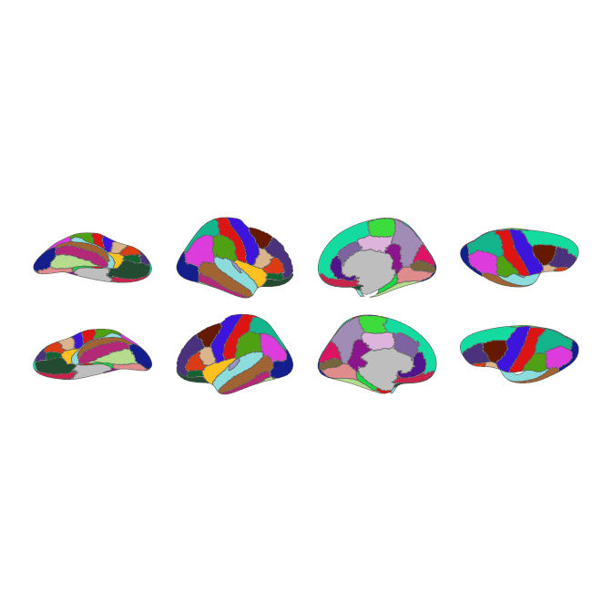

<!-- README.md is generated from README.qmd. Please edit that file -->

# ggsegDKT 

<!-- badges: start -->

[](https://github.com/ggseg/ggsegDKT/actions)
[](https://zenodo.org/badge/latestdoi/314486110)
<!-- badges: end -->

This package contains dataset for plotting the DKT cortical atlas with
ggseg and ggseg3d.

## Installation

We recommend installing the ggseg-atlases through the ggseg
[r-universe](https://ggseg.r-universe.dev/ui#builds):

``` r
options(repos = c(
  ggseg = "https://ggseg.r-universe.dev",
  CRAN = "https://cloud.r-project.org"
))

install.packages("ggsegDKT")
```

You can install the released version of ggsegDKT from
[GitHub](https://github.com/) with:

``` r
# install.packages("remotes")
remotes::install_github("ggseg/ggsegDKT")
```

## Example

``` r
library(ggsegDKT)
```

``` r
library(ggseg)
library(ggplot2)

ggplot() +
  geom_brain(
    atlas = dkt(),
    mapping = aes(fill = label),
    position = position_brain(hemi ~ view),
    show.legend = FALSE
  ) +
  scale_fill_manual(values = dkt()$palette, na.value = "grey") +
  theme_void()
```



``` r
library(ggseg3d)

ggseg3d(atlas = dkt()) |>
  pan_camera("right lateral")
```

## Code of Conduct

Please note that the ggsegDKT project is released with a [Contributor
Code of
Conduct](https://contributor-covenant.org/version/2/0/CODE_OF_CONDUCT.html).
By contributing to this project, you agree to abide by its terms.
